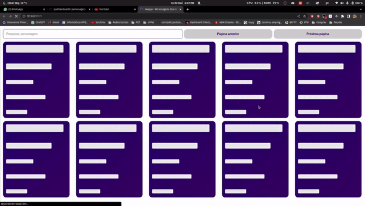

# Star Wars Characters - React.js

Este é um projeto React.js que utiliza a API SWAPI (https://swapi.dev/) para listar os personagens de Star Wars. A interface construída permite visualizar os personagens, filtrar pelo nome e navegar entre as páginas.

- Link de acesso: https://personagens-star-wars.vercel.app/

## Recursos

A aplicação oferece os seguintes recursos:

- Lista os personagens da API SWAPI em grade.
- Filtrar os personagens pelo nome.
- Paginação dos resultados, exibindo 10 registros por vez.
- Botões de navegação para alternar entre as páginas.

## Tecnologias Utilizadas

A aplicação é desenvolvida utilizando as seguintes tecnologias:

- **React.js:** Biblioteca JavaScript para construção de interfaces de usuário.
- **Axios:** Biblioteca para fazer chamadas HTTP para a API SWAPI.

## Pré-requisitos

- Node.js.
- NPM (gerenciador de pacotes do Node.js).

## Como utilizar

1. Clone o repositório para o seu ambiente local.
2. Tenha o node instalado em sua máquina.
3. Execute o comando `npm install` para instalar as dependências do projeto.
4. Execute o comando `npm run dev` para iniciar o servidor local.
5. Acesse o endereço local no seu navegador.
6. Na página, você verá a lista de personagens de Star Wars. Utilize o campo de busca para filtrar os personagens pelo nome. A cada 10 personagens exibidos, haverá botões de paginação para navegar entre as páginas.

## Estrutura de Pastas

- **images:** Imagens utilizadas no README.md.
- **src:** Arquivos da aplicação.
- **components:** Componentes React.
- **pages:** Páginas React.
- **providers:** Serviços de acesso à API.
- **services:** Getters de dados.
- **styles:** Estilos globais da aplicação.
- **utils:** Funções utilitárias.

## Autor

Esta aplicação foi desenvolvida por Juathan Coelho Duarte. Entre em contato pelo e-mail juathanduarte13@gmail.com para mais informações.